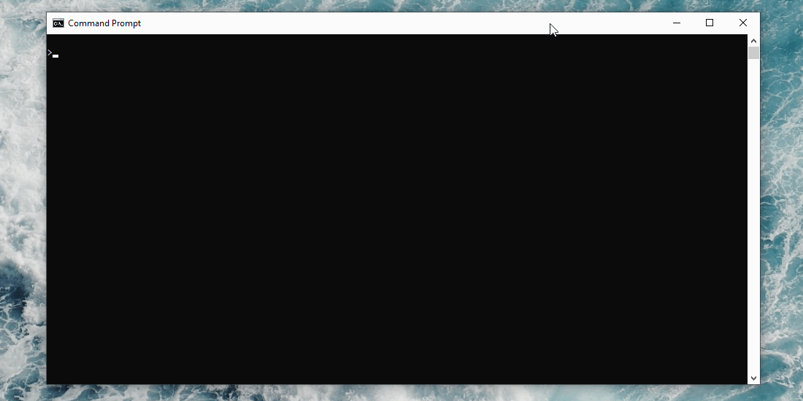
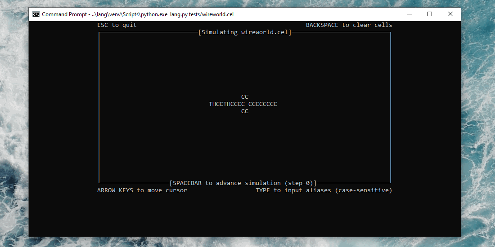

# Requirements
python 3.x

# Build Instructions
1. Navigate to the deerlang directory.
2. Install dependencies (use of virtual environment is recommended): pip install -r requirements.txt
3. Run example: python deerlang.py tests/life.cel

# The <sub>deerlang</sub> Language
This language allows users to define cellular automata and run them in an interactive shell.

# Components of a <sub>deerlang</sub> script
## Meta
Contains meta properties for simulation. Support "Rows" and "Cols" properties. If not defined, default values are Rows=20 and Cols=80.

Example:
```
Meta {
  Rows = 10
  Cols = 10  
}
```

## Cell
Defines the properties of each cell on the grid and their default values. Support properties of type int or bool.

Example:
```
Cell {
  bool live = false
  int type = 1
}
```

## Aliases
Defines how cells are displayed in the UI and how the user can modify cells in the UI. Although not currently enforces, alias names should be a single letter. Note that letters N, S, E, and W are not allowed, since they are the available <sub>deers</sub>.

In the interactive UI, cells whose properties match that of an alias will be displayed with that alias' name. Typing an alias name on a cell will modify that cell's properties to match those defined by the alias.

Example:
```
Aliases {
  L = {
    life = true
  }
}
```

## Selectors
Defines boolean functions used to select cells based on their properties. Selectors are used to determine the transformation rules applied to each cell. Note that selectors support composition. Do not compose selectors in such a way that a circular reference is formed. We don't know what will happen but it will likely be bad. The built-in MatchCount function can be used to find the number of neighbouring cells matching the specified selector. The MatchCount function takes 2 arguments, the list of cells to check, and the selector to apply. The list of cells to check can either be the reserved word "neighbour" (meaning all 8 neighbours) or a list of cardinal directions, e.g. [N, NW, SW, E].

Example:
```
Selectors {
  LiveCell = (live = true)
  DeadCell = !LiveCell
  BabyCell = DeadCell & (MatchCount(neighbours, LiveCell) == 3)
}
```

## Rules
Defines transformation rules for cells. Each rule has an associated selector. For each cell, the first defined rule whose selector matches the cell will be applied to determine the cell's next state.

Example:
```
Rules {
  Death (LiveCell) = {
    live = false
  }

  Birth (DeadCell) = {
    live = true
  }
}
```

# Examples
All examples are found in the deerlang/tests/ directory. The interesting examples are life.cel (Conway's Game of Life) and wireworld.cel (Wireworld).

## Conway's Game of Life

All cells start as being dead. Live cells are displayed by "L". A cell can be made live by typing "L". For a description of Conway's Game of Life, see https://en.wikipedia.org/wiki/Conway%27s_Game_of_Life.

## Wireworld

All cells start type 0 (no interaction). Conductors have alias "C". Electron heads have alias "H". Electron tails have alias "T". For a description of Wireworld, see https://en.wikipedia.org/wiki/Wireworld.

# FAQ

Q: Why is it called <sub>deerlang</sub>?
A: Because dir is a built-in function in python. Subscript because it is small.

Q: How does this involve patterns?
A: Selectors are a form of pattern matching. Additionally, well-behaved programs in <sub>deerlang</sub> tend to display patterns in their execution.
