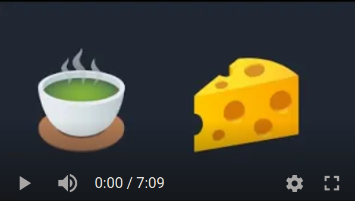

# 🍵🧀

Matcharoni<sub>('n cheese)</sub> is a mixed paradigm language based around
pattern matching, and has been developed around parsing and solving
[Advent of Code 2021](https://adventofcode.com/) problems.

To get a taste of the language, let's parse some Advent of Code puzzle inputs in
this README.

You can see full solutions in the [examples dir](./examples/) or the Advent of
Code video:

[](https://www.youtube.com/watch?v=2GnqHe2wx_M)

### [Day 1: Sonar Sweep](https://adventofcode.com/2021/day/1)

Our `input.txt` contains:

```
199
200
208
210
200
207
240
269
260
263
```

A list of integers separated by newlines, classic. Let's start with a single
`digit`.

```elm
pat digit { '0' => 0, '1' => 1, '2' => 2, '3' => 3, '4' => 4, '5' => 5, '6' => 6, '7' => 7, '8' => 8, '9' => 9 }
```

The `number` pattern below matches one or more digits, and binds that to the
`digits` variable. That is, `@` is for binding **pattern matches** into
variables that can be used in the **pattern expression**.

```elm
// `digit` is a reference to the pattern we defined earlier, and bound to the
// `digits` variable using the `digits@` syntax.
pat number (digits@[digit]{1+}) => {
  // `digits` is used in the list comprehension below
  sum [(*digits * (10 ** (#digits - (%digits + 1)))) <- digits]
}
```

The list comprehension has a bunch of special symbols in it.

- `[*xs <- xs]` is a list comprehension. `xs` is the list being mapped over, and
  `*xs` is the individual list on that iteration

  **Mnemonic: `*`, kinda like deref in C**
- `%xs` is the index of the current element in the map expression. For example,
  `[%xs <- ['a', 'a', 'a']]` produces `[0, 1, 2]`

  **Mnemonic: `%`, as in the _percentage_ we've progressed through the list**
- `#xs` is the length of `xs`.

  **Mnemonic: `#`, as in _number of elements_**

And now we can match the whole input,

```elm
pat parse_input ([numbers<@number ~ '\n']{1+}) => numbers
```

- `numbers<@PAT` means take all matches of the `number` pattern found while
  matching the expression and shovel them into the `numbers` list
- `~` is the **concat** operator

Let's also define `sum` which we used in the `number` pattern but never defined.

```elm
pat sum ns@[Int] => {
  acc = 0
  for ns { acc = acc + *ns }
  acc
}
```

And boom!

```elm
dbg(parse_input(read_to_string("./input.txt")))
```

`[199, 200, 208, 210, 200, 207, 240, 269, 260, 263]`

We're only covering the parsing in this README. To see the full solution, check
out the [examples dir](./examples/).

### [Day 4: Giant Squid](https://adventofcode.com/2021/day/4)

Our `input.txt` contains some comma separated numbers followed by 2 newlines,
followed by some bingo cards, separated by two newlines each.

```
7,4,9,5,11,17,23,2,0,14,21,24,10,16,13,6,15,25,12,22,18,20,8,19,3,26,1

22 13 17 11  0
 8  2 23  4 24
21  9 14 16  7
 6 10  3 18  5
 1 12 20 15 19

 3 15  0  2 22
 9 18 13 17  5
19  8  7 25 23
20 11 10 24  4
14 21 16 12  6

14 21 17 24  4
10 16 15  9 19
18  8 23 26 20
22 11 13  6  5
 2  0 12  3  7
```

Let's start with the comma separated numbers at the top, reusing the `number`
pattern from the previous example:

```elm
pat csnums ([nums<@number ~ ','] ~ nums<@number) => nums
```

The twist here is that we shovel into nums (`nums<@`) twice, once to bind number
preceded by commas, and one for the last number which isn't followed by a comma.

```elm
// returns a list of numbers (one row)
pat bingo_row [[' '] ~ nums<@number]{5} => nums
// returns a list of list of numbers (the whole card)
pat bingo_card [rows<@bingo_row ~ '\n']{5} => rows
```

- `[' ']` means to match any number of spaces
- `{5}` means that the preceding list needs to contain exactly 5 elements

Putting it all together, chained together with `~` (concat) operators, we have a
high level description of our input:

```elm
pat parse_input (called@csnums ~ ['\n'] ~
                 [cards<@bingo_card ~ ['\n']]) => {
  (called, cards)
}

// and it returns a tuple that we can destructure
(called, cards) = parse_input(read_to_string("./input.txt"))
dbg("called", called)
dbg("cards", cards)
```

Outputs

```
("called", [7, 4, 9, 5, 11, 17, 23, 2, 0, 14, 21, 24, 10, 16, 13, 6, 15, 25, 12, 22, 18, 20, 8, 19, 3, 26, 1])
("cards", [[[22, 13, 17, 11, 0], [8, 2, 23, 4, 24], [21, 9, 14, 16, 7], [6, 10, 3, 18, 5], [1, 12, 20, 15, 19]], [[3, 15, 0, 2, 22], [9, 18, 13, 17, 5], [19, 8, 7, 25, 23], [20, 11, 10, 24, 4], [14, 21, 16, 12, 6]], [[14, 21, 17, 24, 4], [10, 16, 15, 9, 19], [18, 8, 23, 26, 20], [22, 11, 13, 6, 5], [2, 0, 12, 3, 7]]])
```

You can find the full solution in the [examples dir](./examples/).

## Build and run instructions

Matcharoni<sub>('n cheese)</sub> depends on
[Rust nightly](https://www.rust-lang.org/tools/install). If you're a Rust
programmer, you know what to do. Just make sure you have the nightly version of
the compile enabled, since this won't compile on Rust stable.

```bash
$ cargo build --release && ./target/release/matcharoni
# or
$ cargo install --path . && matcharoni
```

## Status

This is a proof of concept for [langjam #2](https://github.com/langjam/jam0002)
where we had a week to make a language around the theme `"patterns"`. Future
plans for this language include a code formatter, type checker with inference,
and a way to debug patterns that don't match.

In the shorter term, I'd like to add anonymous patterns (à la anonymous
functions), and being able to bind patterns to variables in any block scope
using the `@=` operator.

And to basically evolve the language of the design using this year's Advent of
Code problems.

## Let's chat

Find me in the `#langdev` ~~cult~~ channel on the
[Rust Community Discord](https://discord.gg/rust-lang-community)
