Motif Lang
==========

Motif is an esoteric, symbol-agnostic programming language based on combination of line patterns.

Building
--------
1. Install nodejs & npm
2. Run `npm install` to install the dependencies
3. Run `npm run build` to build the source code

Running
-------
To start a motif program, run `./motif [filename]` or `npm start [filename]`. Motif program can be a png file or a text file.
```bash
./motif examples/hello_world.txt
./motif examples/factorial.png
npm start examples/fibonacci
```

Code Examples
--------
Code examples are provided in `examples` directory. Below are some visually interesting examples.

| Program | Fibonacci | Factorial | Heart |
| -- | -- | -- | -- |
| **Description** | Print fib(0) to fib(20) | Calculate 5! | Print an ASCII art image of a heart |
| **Code** | 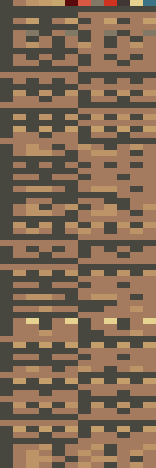 | 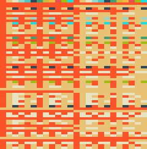 | 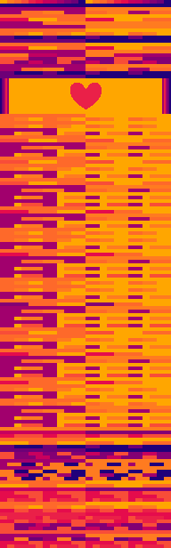 |


How Motif Works
===============

Patterns
--------
Motif is designed to be symbol-agnostic as much as possible. Instead relying on symbols and keywords,
all instructions in motif is composed of character or pixel pattern. There are 6 patterns and 1 special patterns in motif:

0. Solid (Special Pattern)

   Solid pattern is composed of cells of one symbol (a UTF-8 character or a pixel's 32-bit RGBA color). Solid pattern is not used for instruction, but for section marker. Examples:

   `a` is a solid pattern of color "a"

   `😃😃😃😃😃😃😃😃😃` is a solid pattern of color "😃"

   A 12-pixel row 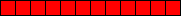 is a solid pattern of color #FF0000


1. Rainbow

   Rainbow pattern is composed of cells of a symbol followed by cells of other symbols without any repetition, and the length of cell streak is the same for every symbol.
   Examples:

   `ab` is a rainbow pattern with colors ["a", "b"], each has cell width of 1

   `eeeeefffff😃😃😃😃😃` is a rainbow pattern with colors ["e", "f", "😃"], each has cell width of 5

   A 12-pixel row 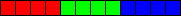 is a rainbow pattern with colors [#FF0000, #00FF00, #0000FF], each has cell width of 4

2. Irregular Rainbow

   Irregular Rainbow pattern is the same like Rainbow pattern, but the cell streak lengths are different. Examples:

   `aab` is an irregular rainbow pattern with colors ["a", "b"] and cell widths of [2, 1]

   `eeeffff😃😃😃😃😃` is an irregular rainbow pattern with colors ["e", "f", "😃"] and cell widths of [3, 4, 5]

   A 12-pixel row 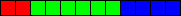 is a rainbow pattern with colors [#FF0000, #00FF00, #0000FF] and cell widths of [2, 6, 4]

3. Checkerboard

   Checkerboard pattern is composed of cells of a symbol followed by cells of other symbols with at least 1 repetition to the first symbol. The length of cell streak is the same for every symbol. Examples:

   `ababab`, is a checkerboard pattern with colors ["a", "b"] repeated 3 times, each has cell width of 1

   `eeff😃😃ee`, is a checkerboard pattern with colors ["e", "f", "😃"] repeated ~2 times (incomplete), each has cell width of 2

   A 12-pixel row 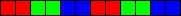 is a checkerboard pattern with colors [#FF0000, #00FF00, #0000FF] repeated twice, each has cell width of 2

4. Irregular Checkerboard

   Irregular Checkerboard pattern is the same like Checkerboard pattern, but the cell streak lengths are different. Examples:

   `aababbb` is an irregular checkerboard pattern with colors ["a", "b"] repeated 2 times, and widths of [2, 1, 1, 3]

   `eeff😃😃e`, is an irregular checkerboard pattern with colors ["e", "f", "😃"] repeated ~2 times (incomplete), and widths of [2, 2, 2, 1]

   A 12-pixel row 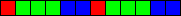 is an irregular checkerboard pattern with colors [#FF0000, #00FF00, #0000FF] repeated twice, and widths of [1, 3, 2, 1, 3, 2]

5. Wave

   Wave patterns is composed of cells of a symbol followed by cells of other symbol, but after the last unique symbol is used it's followed by the previous symbols in reverse order. The length of cell streak must be the same for every symbol. Examples:

   `abcbabcba` is a wave pattern with colors ["a", "b", "c"], each has cell width of 1

   `eeff😃😃hh😃😃ffeeff` is a wave pattern with colors ["e", "f", "😃", "h"], each has cell width of 2

   A 12-pixel row  is a wave pattern with colors [#FFFFFF, #999999, #000000], each has cell width of 1

6. Irregular Wave

   Irregular Wave pattern is the same like Wave pattern, but the cell streak lengths are different. Examples:

   `abbcbaa` is a wave pattern with colors ["a", "b", "c"] and cell widths of [1, 2, 1, 1, 2]

   `ef😃😃hhh😃😃fe` is a wave pattern with colors ["e", "f", "😃", "h"] and cell widths of [1, 1, 2, 3, 2, 1, 1]

   A 12-pixel row  is a wave pattern with colors [#FFFFFF, #999999, #000000] and cell widths of [1, 4, 2, 4, 1]

Parsing Rules
------------

1. Program is parsed line by line. For text programs, a line is ended with CRLF or LF. For image programs, a line is simply a row in the image. The parser will try to match the line to one of the seven patterns.
2. Pattern matching is always done in this order: solid, rainbow, irregular rainbow, checkerboard, irregular checkerboard, wave, irregular wave.
3. Every line that is empty or didn't match any of the seven patterns is skipped as a comment. Example:

    ```
    this is a comment, because it doesn't match any pattern
    also a comment

    the next one is not a comment, since it matches irregular rainbow of colors ["c", "o", "m", "e", "n", "t"]
    comment
    ```
4. Every line that has the same exact pattern (in type, colors, and cell widths) with the last matched line is skipped. This is done to make sure multiple rows of same pattern is treated as one row. Examples:

   ```
   aaaaaa
   aaaaaa
   aaaaaa
   ababab
   ababab
   efefef
   aabbaa
   aabbaa
   ```

   is equivalent to

   ```
   aaaaaa
   ababab
   efefef
   aabbaa
   ```

   It also skip same lines even if it's seperated by empty lines and comments.

   ```
   aaaaaa
   this is a comment


   aaaaaa
   bbbbbb

   bbbbbb
   aaaaaa

   yet another comment

   aaaaaa
   ```

   is equivalent to
   ```
   aaaaaa
   bbbbbb
   aaaaaa
   ```

   Image rows example.

   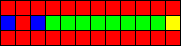

   is equivalent to

   


5. First matched pattern will determine the length of all subsequent patterns. Any line that doesn't have the right length will be skipped as a comment, even if it may match a pattern. This rule is only relevant to text programs, because lines always have consistent length in image programs. Example:
   ```
   aabbcc
   abc
   aaaa
   aaaaaa
   bbbbbbbbbbbbbb
   aaaaaa
   ```

   is equivalent to

   ```
   aabbcc
   aaaaaa
   ```

Program Structure
-----------------

A motif program is composed of palettes and sections. A palette defines what symbols (UTF-8 characters or 32-bit RGBA color) that can be used in the program and maps them to color IDs. Palettes are declared by using any non-solid patterns matched before the first section. Every palette must has different symbols

Sections serve like functions like in other programming languages. They are declared with a solid pattern, and followed by the pattern-encoded instructions that will be executed when the section is called. The first section after palette declarations is the main section, meaning it will be called first when the program runs.

Consider this text program:
```
abcdef
ghighi

iiiiii
aaabbb
ababab
efefef
hhhiii

eeeeee
dddeee
fghgfg
```

The program has 2 palettes definition: `abcdef` and `ghighi`. Together, these palettes are interpreted as the following symbol-color id mapping:
```
a = 0, b = 1, c = 2, d = 3, e = 4, f = 5, g = 6, h = 7, i = 8
```

The program also has 2 sections:
1. Section 8 (or, colored "i"). It contains 2 pattern-encoded instructions: rainbow->checker (`aaabbb`->`ababab`) and checker->rainbow (`efefef`->`hhhiii`).
   This is the main section.

2. Section 4 (or, colored "e"). It contains 1 pattern-encoded instruction: rainbow->wave (`dddeee`->`fghgfg`).

Consider this image program:

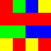

The program has 1 palette definition: 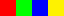. It will be interpreted as the following mapping:
```
red (#FF0000) = 0, green (#00FF00) = 1, blue (#0000FF) = 2, yellow (#FFFF00) = 3
```

The program also has only 1 section, Section 0 (or, colored red). It contains 1 pattern encoded instruction rainbow->checker ( 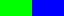 -> 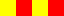 )

Instructions
------------

Motif VM is a stack machine with 30 instruction, mapped to pairs of different patterns from 6 non-solid patterns. Pairs of the same pattern type is parsed as a `NOP` operator and thus won't affect execution.

<table>
    <thead >
        <tr>
            <th rowspan="2">
                First Pattern
            </th>
            <td colspan="6" rowspan="1" align="center">
                <b>Second Pattern</b>
            </td>
        </tr>
        <tr>
            <th align="center">Rainbow</th>
            <th align="center">Checker</th>
            <th align="center">Wave</th>
            <th align="center">Irreg. Rainbow</th>
            <th align="center">Irreg. Checker</th>
            <th align="center">Irreg. Wave</th>
        </tr>
    </thead>
    <tbody>
        <tr><td><b>Rainbow</b></td>
            <td align="center">-</td> <td align="center"><a href="#instrpush">push</a></td>
            <td align="center"><a href="#instradd">add</a></td> <td align="center"><a href="#instrmod">mod</a></td>
            <td align="center"><a href="#instrload">load</a></td> <td align="center"><a href="#instrdup">dup</a></td>
        </tr>
        <tr><td><b>Checker</b></td>
            <td align="center"><a href="#instrpop">pop</a></td> <td align="center">-</td>
            <td align="center"><a href="#instrmul">mul</a></td> <td align="center"><a href="#instrequal">equal</a></td>
            <td align="center"><a href="#instrgreater">greater</a></td> <td align="center"><a href="#instrfwd_if">fwd_if</a></td>
        </tr>
        <tr><td><b>Wave</b></td>
            <td align="center"><a href="#instrsub">sub</a></td> <td align="center"><a href="#instrdiv">div</a></td>
            <td align="center">-</td> <td align="center"><a href="#instrand">and</a></td>
            <td align="center"><a href="#instrfwd">fwd</a></td> <td align="center"><a href="#instrstartblock">startblock</a></td>
        </tr>
        <tr><td><b>Irreg. Rainbow</b></td>
            <td align="center"><a href="#instrpow">pow</a></td> <td align="center"><a href="#instrnot">not</a></td>
            <td align="center"><a href="#instror">or</a></td> <td align="center">-</td>
            <td align="center"><a href="#instrcall">call</a></td> <td align="center"><a href="#instrprintint">printint</a></td>
        </tr>
        <tr><td><b>Irreg. Checker</b></td>
            <td align="center"><a href="#instrstore">store</a></td> <td align="center"><a href="#instrless">less</a></td>
            <td align="center"><a href="#instrback">back</a></td> <td align="center"><a href="#instrreturn">return</a></td>
            <td align="center">-</td> <td align="center"><a href="#instrprintchar">printchar</a></td>
        </tr>
        <tr><td><b>Irreg. Wave</b></td>
            <td align="center"><a href="#instrswap">swap</a></td> <td align="center"><a href="#instrback_if">back_if</a></td>
            <td align="center"><a href="#instrendblock">endblock</a></td> <td align="center"><a href="#instrhalt">halt</a></td>
            <td align="center"><a href="#instrprintsym">printsym</a></td> <td align="center">-</td>
        </tr>
    </tbody>
<table>

### Notation
Instructions is described with following notation:
- [a b ...] -> [c d ...] = Stack manipulation from before execution to after. For example:

  [a b] -> [ ] = the instruction will pop b and then pop a from stack

  [ ] -> [a b] = the instruction will push a and then push b to stack (b at top as the result)

- `sumcolor(P)` = the sum of set of all color id used by P.

  For example, for pattern P = `abcabc` and palette mapping `a=0, b=1, c=2`, then `sumcolor(P)` = 0 + 1 + 2 = 3.

- `first_pattern` and `second_pattern` = the first and second pattern that encoded the instruction.

  For example, for a `push` instruction, `first_pattern` is a rainbow pattern and `second_pattern` is a checker pattern

- `diff(first_pattern, second_pattern)` = `sumcolor(second_pattern) - sumcolor(first_pattern)`

  The difference of sumcolor of second pattern and first pattern.

  For example, for pattern P1 = `abcabc`, P2 = `aabbdd` and palette mapping `a=0, b=1, c=2, d=3`,
  then `diff(P1, P2)` = 4 - 3 = 1


### 1. <a name="instrpush">push</a> x, [ ] -> [ x ]
Pattern: rainbow -> checker

Push integer `x` where `x = diff(first_pattern, second_pattern)` to the stack.

### 2. <a name="instrpop">pop</a> [ x ] -> [ ]
Pattern: checker -> rainbow

Pop the top value of the stack.

### 3. <a name="instrdup">dup</a> [ x ] -> [ x x ]
Pattern: rainbow -> irregular wave

Duplicate the top value of the stack

### 4. <a name="instrswap">swap</a> [ x y ] -> [ y x ]
Pattern: irregular wave -> rainbow

Swap the top two value of the stack

### 5. <a name="instrload">load</a> [ addr ] -> [ x ]
Pattern: rainbow -> irregular checker

Load value from memory at address `addr`, then push it to the stack.

The value of `addr` must be between 0-655356, otherwise it will throw a runtime error.

### 6. <a name="instrstore">store</a> [ x addr ] -> [ ]
Pattern: irregular checker -> rainbow

Store value `x` to memory at address `addr`

The value of `addr` must be between 0-655356, otherwise it will throw a runtime error.

### 7. <a name="instradd">add</a> [ x y ] -> [ z ]
Pattern: rainbow -> wave

Calculate `z = x + y` and push `z` to the stack

### 8. <a name="instrsub">sub</a> [ x y ] -> [ z ]
Pattern: wave -> rainbow

Calculate `z = x - y` and push `z` to the stack

### 9. <a name="instrmul">mul</a> [ x y ] -> [ z ]
Pattern: checker -> wave

Calculate `z = x * y` and push `z` to the stack

### 10. <a name="instrdiv">div</a> [ x y ] -> [ z ]
Pattern: wave -> checker

Calculate `z = x div y`, `div` being integer division operator, and push `z` to the stack

### 11. <a name="instrmod">mod</a> [ x y ] -> [ z ]
Pattern: rainbow -> irregular rainbow

Calculate `z = x mod y`, `mod` being module operator, and push `z` to the stack

### 12. <a name="instrpow">pow</a> [ x y ] -> [ z ]
Pattern: irregular rainbow -> rainbow

Calculate `z = x pow y`, `pow` being power operator, and push `z` to the stack

### 13. <a name="instrgreater">greater</a> [ x y ] -> [ z ]
Pattern: checker -> irregular checker

Calculate `z = (x > y) ? 1 : 0` and push `z` to the stack

### 14. <a name="instrless">less</a> [ x y ] -> [ z ]
Pattern: irregular checker -> checker

Calculate `z = (x < y) ? 1 : 0` and push `z` to the stack

### 15. <a name="instrequal">equal</a> [ x y ] -> [ z ]
Pattern: checker -> irregular rainbow

Calculate `z = (x == y) ? 1 : 0` and push `z` to the stack

### 16. <a name="instrnot">not</a> [ x ] -> [ z ]
Pattern: irregular rainbow -> checker

Calculate `z = (!x) ? 1 : 0` and push `z` to the stack

### 17. <a name="instrand">and</a> [ x y ] -> [ z ]
Pattern: wave -> irregular rainbow

Calculate `z = (x && y) ? 1 : 0` and push `z` to the stack

### 18. <a name="instror">or</a> [ x y ] -> [ z ]
Pattern: irregular rainbow -> wave

Calculate `z = (x || y) ? 1 : 0` and push `z` to the stack

### 19. <a name="instrstartblock">startblock</a>
Pattern: wave -> irregular wave

Start a block. `startblock` must have a matching `endblock`, otherwise the parser will report error.

### 20. <a name="instrendblock">endblock</a>
Pattern: irregular wave -> wave

End a block. `endblock` must have a matching `startblock`, otherwise the parser will report error.

### 21. <a name="instrfwd">fwd</a> x
Pattern: wave -> irregular checker

Jump forward to the end of an enclosing `x`-th block starting from 0, for `x = diff(first_pattern, second_pattern)`.

For example, in case of `x == 0` it means `fwd` will jump to the end of current block, `x == 1` to the end of the current block's parent block,
`x == 2` to the end of the parent's parent, etc.

The parser will report error if `fwd` is not enclosed by the right amount of blocks.

### 22. <a name="instrback">back</a> x
Pattern: irregular checker -> wave

Jump back to the start of an enclosing `x`-th block starting from 0, for `x = diff(first_pattern, second_pattern)`.

For example, in case of `x == 0` it means `back` will jump to the start of current block, `x == 1` to the start of the current block's parent block,
`x == 2` to the start of the parent's parent, etc.

The parser will report error if `back` is not enclosed by the right amount of blocks.

### 23. <a name="instrfwd_if">fwd_if</a> x, [ cond ] -> [ ]
Pattern: checker -> irregular wave

Pop `cond` from stack. If `cond` is not zero, do `fwd x` for `x = diff(first_pattern, second_pattern)`.

All `fwd` validations also applied for `fwd_if`.

### 24. <a name="instrback_if">back_if</a> x, [ cond ] -> [ ]
Pattern: irregular wave -> checker

Pop `cond` from stack. If `cond` is not zero, do `back x` for `x = diff(first_pattern, second_pattern)`.

All `back` validations also applied for `back_if`.

### 25. <a name="instrcall">call</a> x
Pattern: irregular rainbow -> irregular checker

Call section with id equal to `x`, for `x = diff(first_pattern, second_pattern)`.
If section with that id doesn't exist, it will throw a runtime error.

### 26. <a name="instrreturn">return</a>
Pattern: irregular checker -> irregular rainbow

Exit from the section and continue from after the call in caller's section.

If caller doesn't exists (i.e. return in non-recursive or first call of main section), it will halt the program.

### 27. <a name="instrhalt">halt</a>
Pattern: irregular wave -> irregular rainbow

Halt the program.

### 28. <a name="instrprintint">printint</a> [ x ] -> [ ]
Pattern: irregular rainbow -> irregular wave

Print `x` as integer to console.

### 29. <a name="instrprintchar">printchar</a> [ x ] -> [ ]
Pattern: irregular checker -> irregular wave

Print `x mod 256` as ASCII character to console.

### 30. <a name="instrprintsym">printsym</a> [ x ] -> [ ]
Pattern: irregular wave -> irregular checker

Print symbol mapped to color id `x` to console. Character symbols are printed as string, while pixel color symbols are printed as hexadecimal string.
If no symbols are mapped to value of `x`, it will throw a runtime error.

For example, for `x = 3` and palette mapping `a=0, b=1, c=2, d=3`, `printsym` will print "d".
