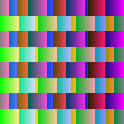
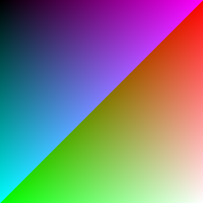
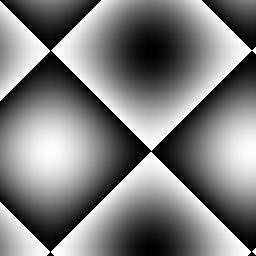
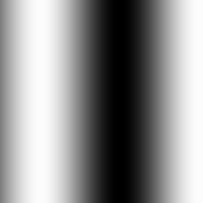
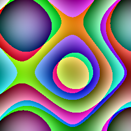
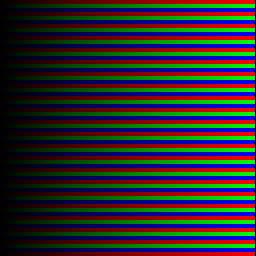
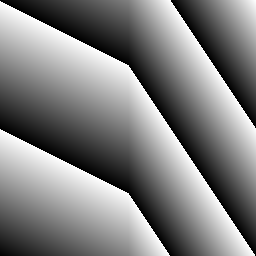

# squiggle

post jam language version is here: [squiggle](https://github.com/kfirmanty/squiggle)

`squiggle` is DSL to describe visual patterns and was created as an entry for `langjam002`

A single `squiggle` executes stack based language with some special operators like `+` modifying the `squiggle` `rgb` vector.

The language operates on patterns. Each pattern is denoted by `[]` and at least one pattern must exist in code.

This is one of the simplest `squiggle`: `[1 1 1 +]`. Each tick it moves one pixel to the right and adds `1 1 1` to its rgb vector. 
If it reaches horizontal or vertical end it wraps. 

After each tick the squiggle colors the pixel under its position to the contents of its `rgb` vector.

Each `tick` one pattern is executed. If `squiggle` code defines more than one pattern: for example `[1 1 1 +] [2 2 2 +]` then it will alternate
between executing `[1 1 1 +]` and `[2 2 2 +]` after every tick. 

Patterns can also be repeated more than once so this:
`[1 1 1 +]3 [2 2 2 +]` will repeat `[1 1 1 +]` for `3` ticks and then `[2 2 2 +]` for `1` tick.

`squiggle` code can also contain conditionals. For it to work it is possible to define code blocks which are denoted by `()` parens.

For example this code `[(1 1 1) (3 3 3) 128 x > if +]` will add `1 1 1` to `rgb` vector when `x` is less or equal to 128 and `3 3 3` otherwise.

For convience the `squiggle` interpreter accepts config `.json` files which can define multiple `squiggles`.

The main idea of `squiggle` is inspired by how image was drawed in old `crt` television.
`squiggle` can have `n` different `squiggles` which can draw on the same canvas, but are not restricted to simple `left to right` as in `crt` beam.

## example config file

```json
{
    "width": 256,
    "height": 256,
    "blendingMode": "ADDITIVE",
    "squiggles": [
        {
            "code": "[1 1 1 +]"
        },
        {
            "code": "[2 -2 7 +] [3 -1 4 +]"
        }
    ]
}
```

which should yield following image:



## how to run

```bash
npm i
node src/index.js examples/basic_conditional.json
```
which should result in file `output.ppm` being generated in project directory.

## gallery






